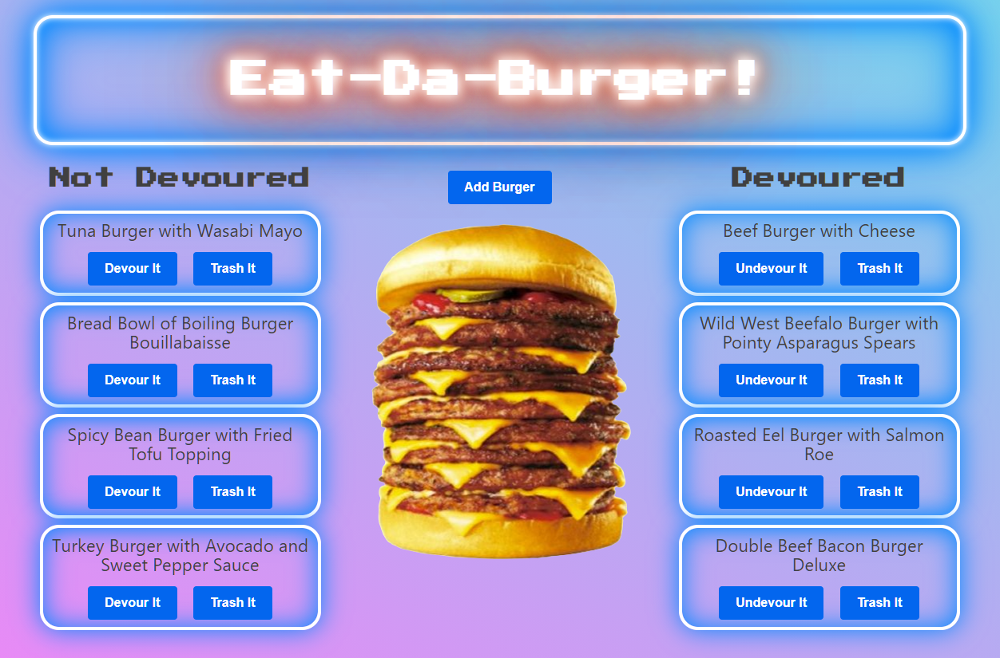

# Eat-Da-Burger 

## Description 

This is a "burger logger"  app (called "Eat-Da-Burger!") that is made with MySQL, Node, Express, Handlebars and a homemade ORM.
*   Eat-Da-Burger! is a restaurant app that lets users input the names of burgers they'd like to eat.
*   Whenever a user submits a burger's name, the app will display the burger on the left side of the page -- waiting to be devoured.
*   Each burger in the waiting area also has a `Devour it!` button. When the user clicks it, the burger will move to the right side of the page.
*   This app will store every burger in a database, whether devoured or not.

**Project Dependencies**

*  express: ^4.17.1
*  express-handlebars: ^5.2.0
*  express-session: ^1.17.1
*  mysql: ^2.18.1
*  nodemon: ^2.0.7
*  passport: ^0.4.1
*  passport-local: ^1.0.0
*  watch: ^1.0.2

[Link to Deployed App](https://warm-sea-12669.herokuapp.com/)

## Table of Contents

*   [Description](#Description)
*   [Installation](#Installation)
*   [Usage](#Usage)
*   [Questions](#Questions)
*   [License](#License)
*   [Contributing](#Contributing)
*   [Tests](#Tests)

## Installation
 
 There is nothing to install to use this web app.

*   [Return to Top](#Eat-Da-Burger)

## Usage 
Use the "Add Burger" button to add a new burger to either the "Not Devoured" list or the "Devoured" list. Click on the "Devour It" button to move a burger to the "Devoured" list, and vice-versa. Click on the "Trash It" button to remove a burger from the app. 

*   [Return to Top](#Eat-Da-Burger)

## Questions

Please contact me at the email address listed below with any questions about this app. 

[jdavidrice@gmail.com](mailto:jdavidrice@gmail.com)

[GitHub Profile](https://github.com/jdavidrice)

[Portfolio](https://jeremyrice.gatsbyjs.io/)

*   [Return to Top](#Eat-Da-Burger)

## License

MIT License

Copyright (c) 2021 Jeremy Rice

Permission is hereby granted, free of charge, to any person obtaining a copy
of this software and associated documentation files (the "Software"), to deal
in the Software without restriction, including without limitation the rights
to use, copy, modify, merge, publish, distribute, sublicense, and/or sell
copies of the Software, and to permit persons to whom the Software is
furnished to do so, subject to the following conditions:

The above copyright notice and this permission notice shall be included in all
copies or substantial portions of the Software.

THE SOFTWARE IS PROVIDED "AS IS", WITHOUT WARRANTY OF ANY KIND, EXPRESS OR
IMPLIED, INCLUDING BUT NOT LIMITED TO THE WARRANTIES OF MERCHANTABILITY,
FITNESS FOR A PARTICULAR PURPOSE AND NONINFRINGEMENT. IN NO EVENT SHALL THE
AUTHORS OR COPYRIGHT HOLDERS BE LIABLE FOR ANY CLAIM, DAMAGES OR OTHER
LIABILITY, WHETHER IN AN ACTION OF CONTRACT, TORT OR OTHERWISE, ARISING FROM,
OUT OF OR IN CONNECTION WITH THE SOFTWARE OR THE USE OR OTHER DEALINGS IN THE
SOFTWARE.

*   [Return to Top](#Eat-Da-Burger)

## Contributing

  [Jeremy Rice](https://www.buymeacoffee.com/jdavidrice)

  Thank you to [George Park](https://www.georgewpark.com/) for his [Flickering Neon Sign Effect](https://codepen.io/GeorgePark/pen/MrjbEr). 

*   [Return to Top](#Eat-Da-Burger)

## Tests

No tests

*   [Return to Top](#Eat-Da-Burger)
